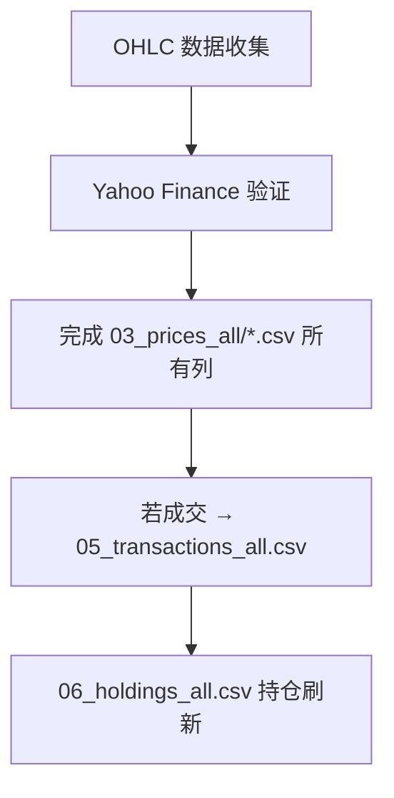

# 🟩 02_collaboration_process.md  
**协作与执行流程（Xinyi’s Execution Protocol + 数据验证）**

---

## 1️⃣ 执行核心逻辑
- 所有决策在盘前完成；  
- 不进行盘中监控；  
- 所有调整通过预挂单实现（含防御挂单 / 突破挂单）。  

---

## 2️⃣ 执行阶段结构（两阶段工作流）

### 阶段1：盘前挂单（悉尼时间 21:00-23:00）

| 步骤 | 输入 | 过程 | 输出 |
|:--|:--|:--|:--|
| **盘前价格查看** | 实时盘前价格 | 查看美股盘前价格 (US 4:00-9:30 AM ET) | 获取当前盘前报价 |
| **PreMarket_Price记录** | 四个盘前价格 (MSFT/QQQ/TSLA/GLD) | 记录到 `03_prices_all/*.csv` 的 PreMarket_Price 列 | 价格数据初步记录 |
| **挂单生成** | PreMarket_Price + 历史仓位 | 基于盘前价格生成分层限价单 | 追加入 `04_order_log.md` |

### 阶段2：收盘后数据记录（美股收盘后）

| 步骤 | 输入 | 过程 | 输出 |
|:--|:--|:--|:--|
| **OHLC数据收集** | 完整 OHLC 数据 | 收集 Open/High/Low/Close/Volume | 完整价格数据 |
| **Yahoo验证** | Yahoo Finance 对照 | 偏差 < ±0.5% → 标记 ✅ | 完成 `03_prices_all/*.csv` 所有列 |
| **成交记录** | 若订单成交 | 记录交易详情 | 更新 `05_transactions_all.csv` |
| **持仓更新** | 成交数据 | 重新计算持仓成本 | 刷新 `06_holdings_all.csv` |

---

## 3️⃣ 数据记录链（两阶段流程）

### 阶段1流程（悉尼21:00-23:00）

### 阶段2流程（美股收盘后）

---

## 4️⃣ 命名与文件结构（统一）

- **价格库**：`03_prices_all/` 目录包含 4 个 CSV 文件
  - `MSFT_prices-Table 1.csv` / `QQQ_prices-Table 1.csv` / `TSLA_prices-Table 1.csv` / `GLD_prices-Table 1.csv`
  - CSV结构：`Date, PreMarket_Price, Open, High, Low, Close, Volume, Screenshot_Source, Verified_Yahoo, Notes`
- **挂单日志**：`04_order_log.md`
- **成交记录**：`05_transactions_all.csv`（中文列名：日期, 操作类型, 标的, 数量, 价格, 金额, 理由, 风险盘余额, 累计转回安全盘）
- **持仓汇总**：`06_holdings_all.csv`（中文列名：标的, 当前持股数, 买入加权平均成本, 持仓成本合计）
- **文件命名**：保持 01–06 统一编号，不带 `_updated`、`_final` 等后缀

## 5️⃣ PreMarket_Price 使用说明

- **记录时间**：悉尼时间 21:00-23:00（对应美股盘前 4:00-9:30 AM ET）
- **用途**：作为当日挂单决策的参考价格
- **历史数据**：历史记录中 PreMarket_Price 填写为 "N/A"
- **数据完整性**：PreMarket_Price 在盘前记录，OHLC 数据在收盘后补充
