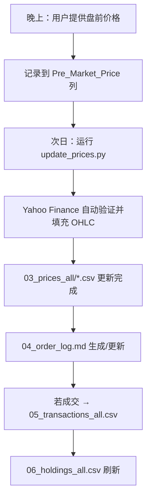

# 🟩 02_collaboration_process.md  
**协作与执行流程（Xinyi’s Execution Protocol + 数据验证）**

---

## 1️⃣ 执行核心逻辑
- 所有决策在盘前完成；  
- 不进行盘中监控；  
- 所有调整通过预挂单实现（含防御挂单 / 突破挂单）。  

---

## 2️⃣ 执行阶段结构（新版命名）

| 阶段 | 输入 | 过程 | 输出 |
|:--|:--|:--|:--|
| **盘前价格输入（晚上）** | 用户提供四个盘前价格（MSFT/QQQ/TSLA/GLD） | 记录到 `Pre_Market_Price` 列 | **写入 `03_prices_all/` 对应 CSV 文件** |
| **收盘数据更新（次日）** | 运行 `update_prices.py` 自动抓取 | 从 Yahoo Finance 获取 OHLC 数据 | 更新 CSV 文件，保留盘前价格作对比 |
| **验证阶段** | Yahoo Finance 自动验证 | 偏差 < ±0.5% → 标记 ✅ | 记录于 **`Verified_Yahoo`** 列 |
| **分析生成** | 结合历史仓位与价格区间 | 自动生成挂单区间 | 追加入 `04_order_log.md` |
| **结果记录** | 若次日成交 | 更新 **`05_transactions_all.csv`** | 触发 `06_holdings_all.csv` 刷新 |
| **持仓汇总** | 当日收盘后 | 输出当日汇总 | `06_holdings_all.csv` |

---

## 3️⃣ 数据记录链（更新）

---

## 4️⃣ 命名与替换规范（统一）

- **价格库**：`03_prices_all/`（CSV 文件：`MSFT_prices-Table 1.csv / QQQ_prices-Table 1.csv / TSLA_prices-Table 1.csv / GLD_prices-Table 1.csv`）
- **CSV 格式**：`Date, Open, High, Low, Close, Volume, Pre_Market_Price, Screenshot_Source, Verified_Yahoo, Notes`
- **挂单日志**：`04_order_log.md`
- **成交记录**：`05_transactions_all.csv`
- **持仓库**：`06_holdings_all.csv`
- **文件命名**：保持 00–06 统一编号，不带 `_updated`、`_final` 等后缀。
- **自动更新脚本**：`update_prices.py`（每日运行以获取最新市场数据）
